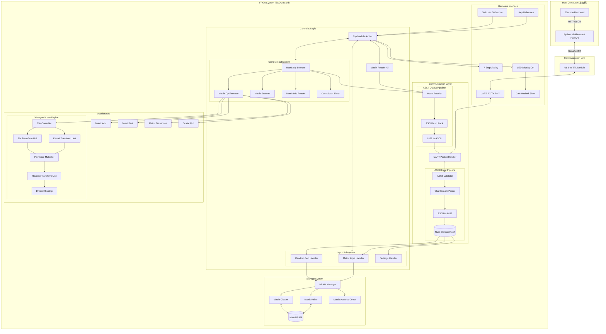

# FPGA 矩阵计算器详细系统架构文档

## 1. 系统架构总览

本项目是一个端到端的矩阵计算系统，涵盖了从前端交互、中间件通信到 FPGA 硬件加速的全链路实现。系统架构分为上位机（Host）、通信链路（Link）和 FPGA 系统（FPGA）三个主要层次。

### 1.1 系统架构框图

---

## 2. 模块详细讲解

### 2.1 上位机层 (Host Computer)
*   **Electron Front-end**: 提供用户友好的图形界面，支持矩阵输入、随机生成参数设置、运算类型选择及结果展示。
*   **Python Middleware (FastAPI)**: 作为前后端桥梁，处理 HTTP 请求并将其转换为串口通信协议，负责与 FPGA 进行原始数据交换。

### 2.2 通信层 (Communication Layer)
*   **UART Packet Handler**: 负责 UART 协议的打包与解包，确保数据传输的可靠性。
*   **ASCII Input Pipeline**: 
    *   `Validator`: 校验输入字符的合法性。
    *   `Parser`: 解析字符流中的数字边界。
    *   `A2I`: 将 ASCII 码转换为 32 位有符号整数。
    *   `Num Storage RAM`: 临时存储解析后的数据。
*   **ASCII Output Pipeline**: 
    *   `Matrix Reader`: 从 BRAM 读取矩阵数据。
    *   `ASCII Num Pack`: 将数字、空格、换行符打包。
    *   `I2A`: 将整数转换为 ASCII 码流发送至上位机。

### 2.3 控制与逻辑层 (Control & Logic)
*   **Top Module Arbiter**: 系统的核心调度器，负责全局状态管理、资源仲裁（UART/BRAM 访问权）以及外设（LED/数码管）控制。
*   **Input Subsystem**: 处理矩阵的存入、随机生成以及系统参数设置。
*   **Compute Subsystem**: 
    *   `Op Selector`: 复杂的交互状态机，引导用户选择操作数并进行合法性检查。
    *   `Op Executor`: 调度具体的硬件加速器执行计算任务。
    *   `Matrix Scanner`: 快速扫描 BRAM 中的矩阵元数据以匹配目标维度。

### 2.4 存储系统 (Storage System)
*   **BRAM Manager**: 统一管理 8 个矩阵存储槽位，提供写保护、自动寻址和快速清空功能。
*   **Main BRAM**: 核心存储单元，存储所有矩阵的元数据和元素数据。

### 2.5 硬件加速层 (Accelerators)
*   **基础运算**: 支持矩阵加法（Add）、矩阵乘法（Mul）、转置（Transpose）和标量乘法（Scalar Mul）。
*   **Winograd Conv Engine**: 针对卷积运算的高性能加速引擎。
    *   采用分块处理（Tile-based）策略。
    *   `KTU/TTU`: 执行 Winograd 域变换。
    *   `PWM`: 6x6 域逐元素点乘。
    *   `RTU`: 逆变换恢复结果块。
    *   `Division`: 最终的缩放校准。

---

## 3. 关键设计特性
1.  **模块化设计**: 各子系统通过标准握手协议通信，易于扩展和维护。
2.  **高性能计算**: 引入 Winograd 算法大幅降低卷积运算的乘法次数。
3.  **健壮性**: 包含输入校验、看门狗监控和错误倒计时重试机制。
4.  **实时反馈**: 通过板载 LED 和数码管实时显示系统状态、运算类型及性能指标。
