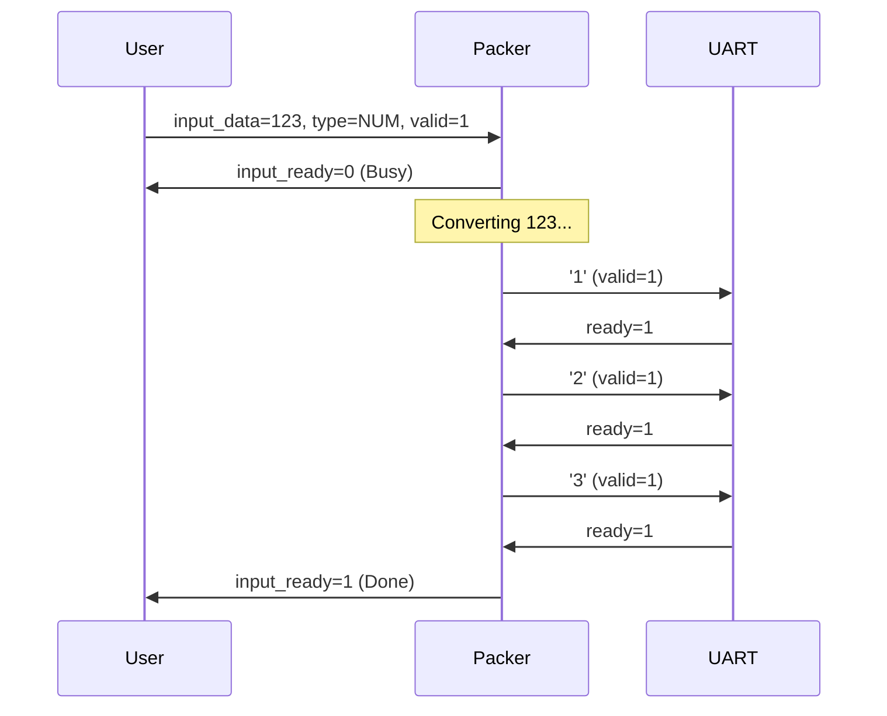

# ASCII 数字打包器 (ASCII Number Packer)

## 模块概述

`ascii_num_pack` 是 `ascii_num_sep` 的逆向功能模块。它接收 32 位有符号整数或控制字符（空格、换行），将其转换为 ASCII 字符流输出。该模块主要用于将 FPGA 内部计算结果通过 UART 等接口发送给上位机显示。

## 功能特性

- **流式输入接口**：支持背压（Backpressure），通过 `valid/ready` 握手协议接收数据。
- **多种输入类型**：
  - **数字 (Number)**：将 32 位有符号整数转换为 ASCII 字符串（支持负数）。
  - **空格 (Space)**：直接输出空格字符 (0x20)。
  - **换行 (Newline)**：直接输出换行字符 (0x0A)。
- **自动转换**：内部集成 `int32_to_ascii` 转换器，自动处理多位数字的转换和符号位。
- **流式输出**：输出标准的 8 位 ASCII 字符流，可直接连接 UART 发送模块。

## 接口定义

### 输入信号

| 信号名 | 位宽 | 说明 |
|--------|------|------|
| clk | 1 | 时钟信号 |
| rst_n | 1 | 异步低电平复位 |
| input_data | 32 | 输入数据（仅当 input_type=0 时有效） |
| input_type | 2 | 输入类型：0=数字, 1=空格, 2=换行 |
| input_valid | 1 | 输入有效信号 |
| ascii_ready | 1 | 下游（如 UART）准备好接收信号 |

### 输出信号

| 信号名 | 位宽 | 说明 |
|--------|------|------|
| input_ready | 1 | 模块准备好接收新输入 |
| ascii_data | 8 | 输出 ASCII 字符 |
| ascii_valid | 1 | 输出有效信号 |
| busy | 1 | 模块忙状态指示 |

## 使用说明

### 1. 发送数字
要发送数字 `123`：
1. 等待 `input_ready` 为高。
2. 设置 `input_data = 123`。
3. 设置 `input_type = 0` (TYPE_NUMBER)。
4. 拉高 `input_valid` 一个周期。

### 2. 发送分隔符
要发送空格：
1. 等待 `input_ready` 为高。
2. 设置 `input_type = 1` (TYPE_SPACE)。
3. `input_data` 可为任意值（忽略）。
4. 拉高 `input_valid` 一个周期。

### 3. 典型时序

## 内部架构

模块主要由两部分组成：
1. **主状态机 (Main FSM)**：负责接收输入请求，根据 `input_type` 调度任务。如果是数字，启动转换器；如果是控制字符，直接输出。
2. **整数转换器 (int32_to_ascii)**：负责将二进制整数转换为 ASCII 码序列。采用迭代除法实现，支持负数处理。

## 资源占用与性能

- **延迟**：转换一个 N 位数字大约需要 N+2 个时钟周期（取决于除法实现）。
- **吞吐量**：受限于 UART 发送速度。模块内部处理速度远高于 UART 波特率。
